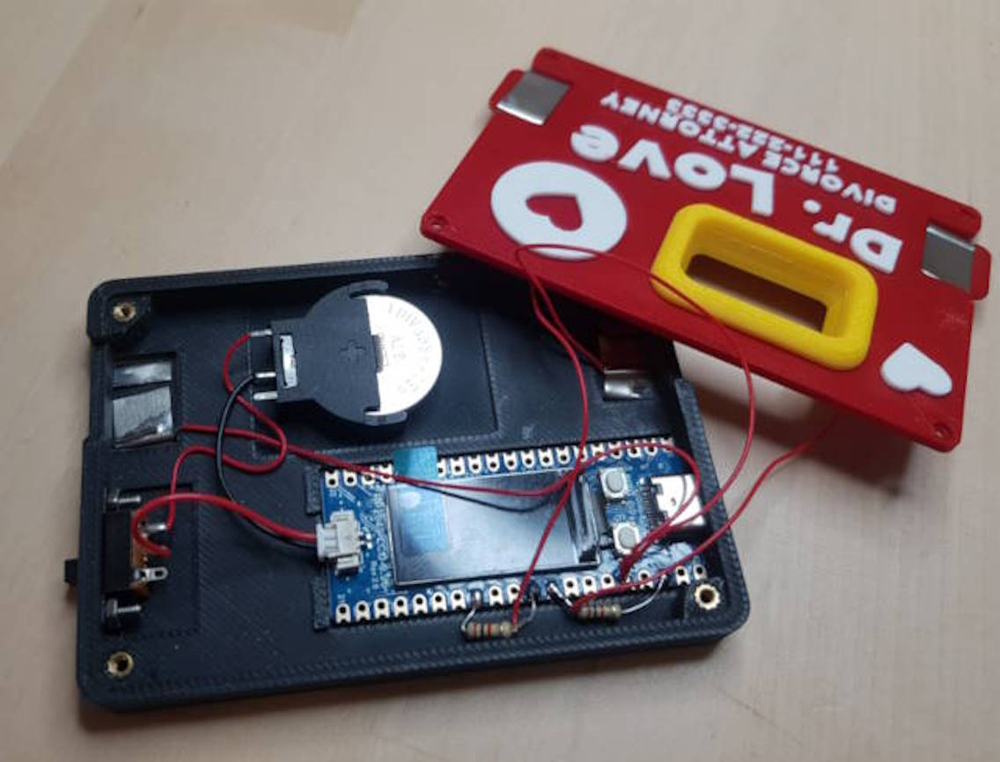

# Dr. Love: a Game of Love Detection 

Dr. Love: is the ultimate gadget to test if your partner is in love with you or just kind of meh. Simply place your fingers on Dr. Love, and it will reveal if neither of you, both of you, or just one of you is in love. Thankfully, it won't spill the beans on which one of you is the lovesick puppy.

# Usecases

Dr. Love is a charming, business-card-sized device that promises to decode the mysteries of love with just a touch. Its compact size and intriguing premise make it an instant conversation starter, leaving everyone curious to give it a try.

Here's the scoop: two people press their fingers against Dr. Love's metal parts for about 10-15 seconds, eagerly awaiting the verdict. Will sparks fly, or will it be a case of "meh"? The anticipation builds as they wait to discover if they're both head over heels or not.

Those 10 seconds of suspense are surprisingly fun, making Dr. Love a decent ice-breaker. As the magic unfolds, conversations flow, and connections deepen. Plus, explaining the inner workings of Dr. Love adds an extra layer of intrigue, keeping everyone engaged.

With its charm, Dr. Love effortlessly steals the spotlight, making it a memorable gift for those special connections. It's not your typical business card giveaway – it's a delightful surprise that leaves a lasting impression.

# How does it work?

Galvanic Skin Response (GSR) is a fancy term that means your skin changes its electrical properties when you sweat. When you get nervous or excited, your body sweats a tiny bit, even if you don't notice it. This sweat makes it easier for electricity to pass through your skin.

Now, think about when you're nervous—like when you're trying to figure out if someone you care about loves you back. You might sweat a little more, right? That's where Dr. Love comes in. 

Dr. Love measures this change in sweat using GSR. It has sensors that you place on your fingers or hand, which detect the slight increase in sweat and, therefore, the change in electrical conductivity of your skin. Dr. Love uses this GSR data to guess if someone is in love. If it detects a spike in sweating when you're near someone you love, it suggests that there might be some serious feelings involved.

This technology is used in lie detectors. You know, one of the quirks of lie detectors is their tendency to falter when someone's feeling a bit jittery or excited. But hey, I'm flipping that defect on its head and turning it into a plus. Why not? Think about it: when you're face-to-face with someone you adore, those heart-fluttering moments can easily send your nerves into overdrive. And guess what? That's exactly what I'm banking on with Dr. Love! We're taking those moments of excitement and turning them into a little game of love detection. It's like taking a glitch and turning it into a feature! 

But here's the kicker—if you're in a seasoned relationship, you might be cool as a cucumber and not sweat at all. That's why Dr. Love thoughtfully includes the phone number of a divorce lawyer on the cover, just in case!

# Build Guide

Dr. Love is a fun DIY project that comes with build guides, perfect for those who enjoy a bit of hands-on tinkering. Just a heads-up: some soldering is required, and incorrect wiring could potentially cause a hazardous fire. But hey, who doesn't want a little adventure in their DIY projects?

If you'd like to get your hands on a Dr. Love, you can find the DIY kit at my online shop or you can source materials own your own. And if you'd rather skip the assembly and get straight to the fun, you can also order a pre-assembled device. Following link below. Happy building!

[Dr. Love Online Shop](https://www.tindie.com/stores/unkyulee/)

## Step 1. What to prepare

Here's a detailed look at the components you'll need for your Dr. Love DIY project:

1. **Microcontroller**:
   - **RP2040-LCD-0.96**: This is a Raspberry Pi Pico microcontroller with a 0.96-inch display attached. You can find it by searching for "RP2040-LCD-0.96".

2. **Battery and Holder**:
   - **Battery**: Use a typical lithium battery with a nominal voltage of 3.6 ~ 3.7V. I've used an LIR2032 coin cell-sized lithium battery for convenience.
   - **Battery Holder**: Search for "CR2032 holder" to find the right battery holder for the LIR2032 battery.
   - **Connector**: You'll need a JST 1.25mm male connector to connect the battery to the microcontroller.

3. **Finger Contacts**:
   - **Nickel Strips**: Use 8mm wide nickel strips to create the contact points for the fingers. Any thickness will work, as long as you can bend them easily.

4. **Additional Components**:
   - **Resistors**: 2k ohm resistors (you'll need two of these).
   - **Slide Switch**: A switch with dimensions of 20mm x 6mm.
   - **Threaded Inserts and Screws**: M2 threaded inserts and screws (you'll need four).
   - **Machine Screws and Nuts**: M2.5 screws and nuts for securing components.
   - **3d prints or Enclosure**: STL for 3d printed parts are in this repository

## Step 2. Solder Nickel Plates with Wires

1. **Prepare the Nickel Plates**:
   - Cut four nickel plates, each about 3 ~ 4 cm long.

2. **Prepare the Wires**:
   - Cut four pieces of wire, 10 cm.
   - Peel off 2 cm of insulation from each end of the wires.

3. **Wrap and Solder**:
   - Wrap one end of each wire around one end of a nickel plate.
   - Apply some soldering paste to the connection point.
   - Use a soldering iron to solder the wire to the nickel plate securely.

### Tips

- Ensure a solid connection by applying enough solder to cover the wire and nickel plate junction.
- Allow the solder to cool and solidify before moving on to the next step.
- Apply soldering paste before soldering, it make it much easier for the soler to adhere.

## Step 3: Solder the Battery Contact and the Slide Switch

1. **Cut the Wires**:
   - Trim the wires from the JST connector to the appropriate length to fit neatly inside the enclosure.

2. **Solder Connections**:
   - **JST Connector GND to Battery Holder GND**: 
     - Solder the ground (GND) wire from the JST connector to the ground terminal on the battery holder.
   - **JST Connector V+ to Slide Switch**:
     - Solder the positive (V+) wire from the JST connector to one terminal of the slide switch.
   - **Battery Holder V+ to Slide Switch**:
     - Solder the positive (V+) terminal of the battery holder to the other terminal of the slide switch.

### Note:
This wiring setup powers the RP2040-LCD-0.96 board while charging because the charge controller is integrated into the board. This isn't the most efficient setup, but it's necessary due to the charging configuration. If anyone has a better wiring solution, suggestions are welcome!

### Tips:
- Double-check your connections to ensure there are no shorts, which could damage the components or cause a fire hazard.
- Use heat shrink tubing or electrical tape to cover exposed solder joints for added safety.

## Step 4: Solder to the RP2040 Board

In this step, you'll solder a resistor and some wiring to the RP2040 board. Follow these instructions carefully and refer to the image to ensure proper connections.

1. **Solder the Resistors**:
   - **GPIO 27**:
     - Solder one end of a 2k ohm resistor to GPIO 27.
     - Solder the other end of the resistor to GND.
   - **GPIO 26**:
     - Solder one end of another 2k ohm resistor to GPIO 26.
     - Solder the other end of the resistor to GND.

2. **Connect the Nickel Plates**:
   - **GPIO 27**:
     - Solder a wire from GPIO 27 to one of the nickel plates.
   - **GPIO 26**:
     - Solder a wire from GPIO 26 to another nickel plate.

3. **Connect 3.3V to the Nickel Plates**:
   - Cut two wires from the 3.3V pin on the RP2040 board.
   - Solder one wire from the 3.3V pin to each of the nickel plates.

### Tips:
- **Check Your Work**: After soldering each connection, double-check against the diagram to ensure accuracy. Incorrect connections can lead to functionality issues or damage.
- **Test the Connections**: Use a multimeter to verify continuity and proper connection of each solder joint.

## Step 5: Assemble

Follow these steps to assemble your Dr. Love device:

1. **Insert the Threaded Inserts**:
   - Heat up the threaded inserts with a soldering iron.
   - Push them into the four corners of the bottom enclosure. This will provide secure threading for the screws.

2. **Install the Sliding Switch**:
   - Place the sliding switch in its designated slot.
   - Secure it using M2.5 machine screws and nuts.

3. **Attach the Battery Holder**:
   - Use double-sided tape or glue to secure the battery holder in place inside the enclosure.

4. **Position the RP2040 Board**:
   - Use double-sided adhesive to stick the RP2040 board to its designated position inside the enclosure.

5. **Install the Nickel Plates**:
   - Place the nickel plates in their corresponding locations within the enclosure, ensuring they are properly connected to the wires.

6. **Close the Enclosure**:
   - Once all components are in place, close the lid of the enclosure.
   - Secure the lid using M2 screws, threading them into the previously installed threaded inserts.

## Step 6: Installing the Firmware

### 1. Install CircuitPython

- Connect the RP2040 board to your PC via USB while pressing down the boot button.
- The board will appear as a storage device on your computer.
- Copy the CircuitPython boot loader file into the storage. You can find the file in the "circuitpyhon" folder in this repository
- Once the file is copied, the RP2040 board will automatically reboot, completing the CircuitPython installation.

### 2. Install Firmware

- Connect the RP2040 board to your PC via USB (without pressing down any buttons).
- Copy all the files from the "src" folder of this repository to the RP2040 board using your PC connected via USB.
- Once the files are copied, the RP2040 will boot into the application that functions as Dr. Love.

# Conclusion

This project stemmed from the Hackaday business card challenge, sparking numerous brainstorming sessions with my wife to create something captivating and memorable, akin to the essence of a business card.

We envisioned the business card as a platform for exchanging impressions and fostering connections between two people. We wanted to offer a device that could reveal something about each person involved, transcending the conventional business card functionalities.

After exploring various ideas, we settled on the concept of a "love" detector, inspired by the notion of two individuals engaging in mutual interaction. Unlike a traditional lie detector, which can be tense and one-sided, we aimed to inject light-heartedness into the interaction by detecting "love" instead.

The idea struck a chord with our friends during testing, proving to be an effective attention-grabber and conversation starter. While Dr. Love may not be suitable for all business contexts, it excels in scenarios where a playful approach is welcomed and engagement is key.

Creating Dr. Love brought immense joy, and witnessing the enjoyment it brought to others was truly rewarding. It also shed light on the surprising reality that many married couples may not be as in love as one might assume, prompting us to include a real divorce lawyer's contact as a tongue-in-cheek addition.

# Online Shop

You can purchase Dr. Love DIY kits, containing 3D prints, components, and materials for assembly, from the following link. Assembled units are also available for those who prefer a ready-to-use device.

[Dr. Love Online Shop](https://www.tindie.com/stores/unkyulee/)
